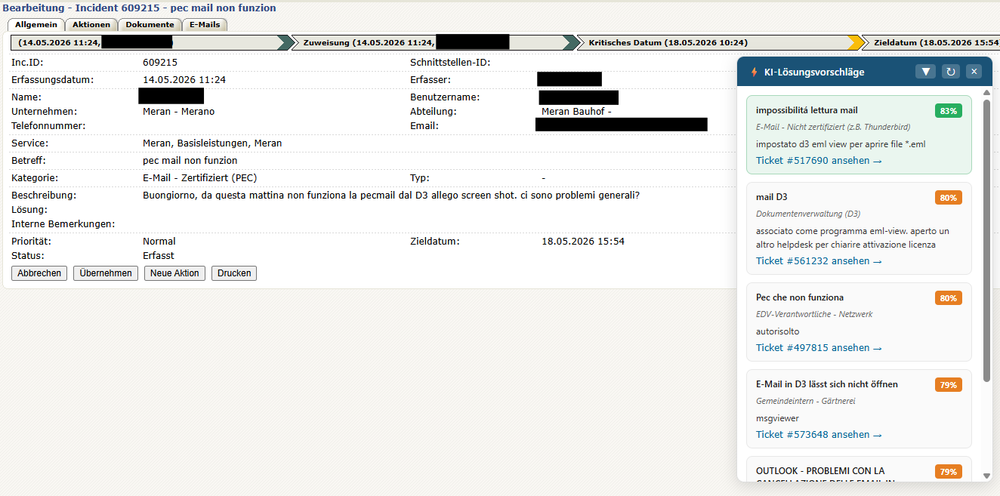

#  carlito — Solution Suggestions

AI-powered solution suggestions for new tickets based on the historical ticket archive.
Runs entirely locally — no cloud, no data leaves the organisation.

  

## Install the Chrome extension

1. Open Chrome → `chrome://extensions/`
2. Enable **Developer mode** (toggle top-right)
3. Click **"Load unpacked"** → select the `extension/` folder
4. Open any ticket on helpdesk.gvcc.net → the sidebar appears automatically

The sidebar appears on all incident pages (`uid=RegIncident`) regardless of status
(Solved, In Progress, New, etc.).

**Sidebar controls:**
- ▼ / ▲ — minimise / restore
- ↻ — re-run search
- × — close
- Drag the header — reposition the panel freely
